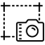
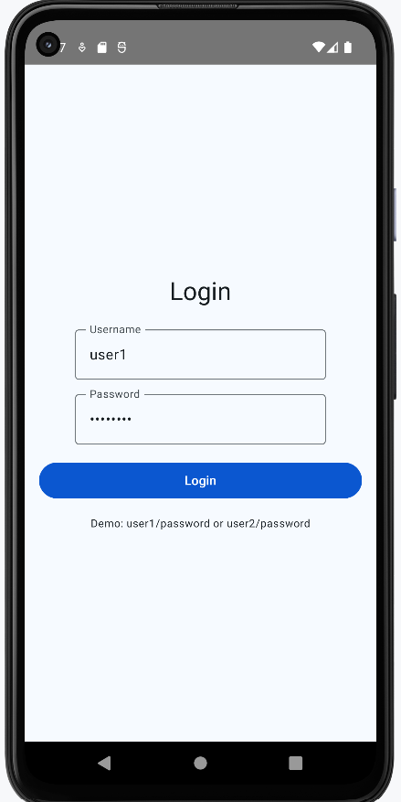
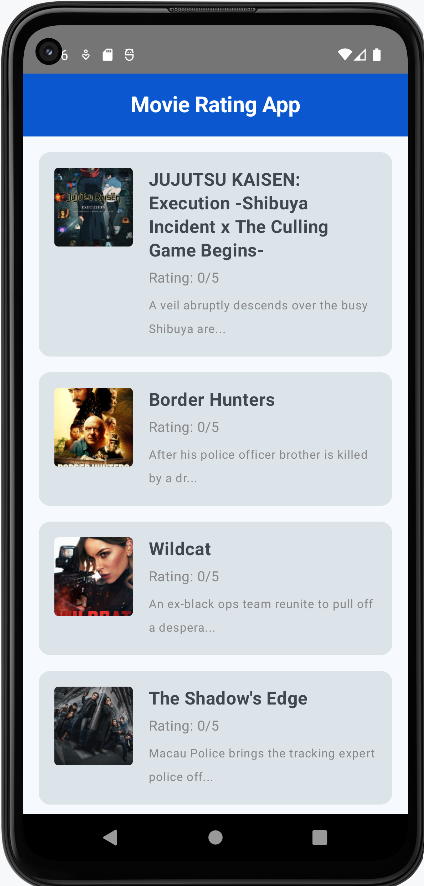
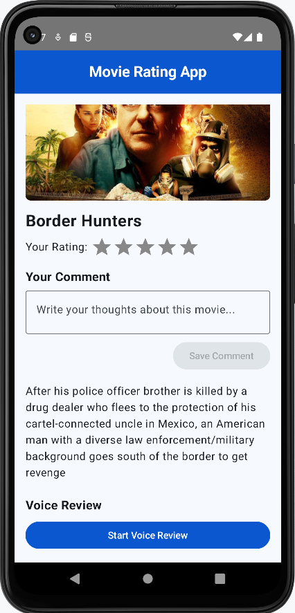
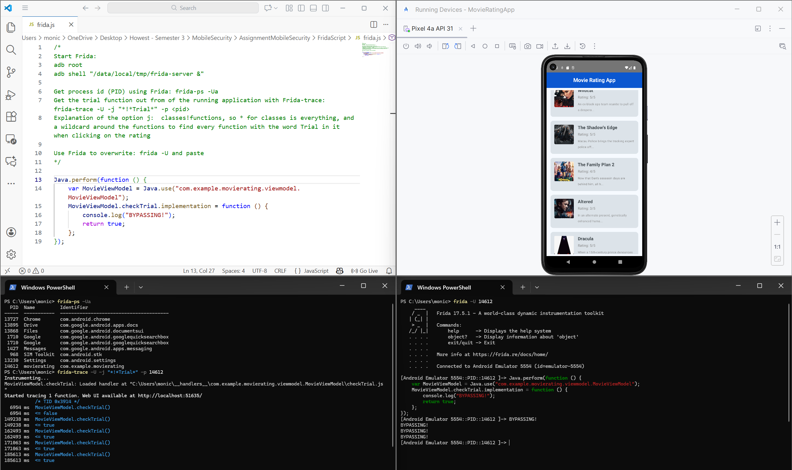
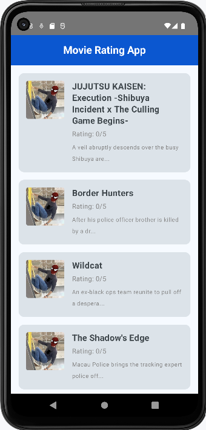
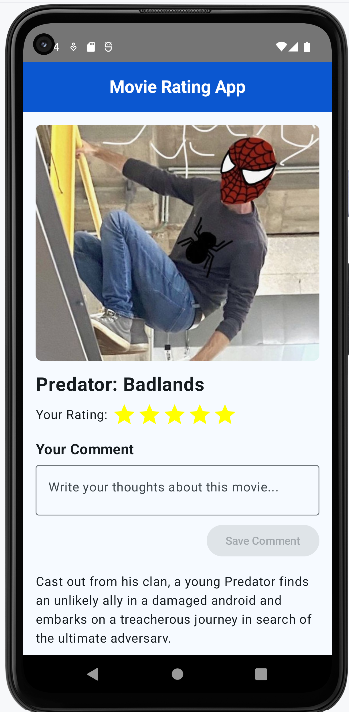

# Mobile Security project - documentation

## Groupmember

1. Monica Repolho
2. Elene Kapanadze
3. Mariam Asatryan
4. Josh Van Wyk

## Project summary

An application that loads movies and allows users to rate it.

## Requirements

| Application                 |
| --------------------------- |
| **Application**             |
| 2 UI screens                |
| Secure API request          |
| API request with IDOR       |
| Connection to room database |
| Secure storage              |

| Security                            |
| ----------------------------------- |
| Unsafe storage                      |
| Malware                             |
| Frida functionality                 |
| Modify Application                  |
| Detect root and block functionality |

## Overview app

###  Screenshots

This app has three main screens:

- The `LoginScreen` shows the simple login form that appears when the app starts.
- The `MovieList_Screen1` shows the list of movies with their titles, posters and current ratings.
- The `MovieDetails_Screen2` shows the detail page for a single movie, where the user can set a star rating, add a comment and work with voice reviews.

###  Secure API request

The app uses secure HTTPS API calls to retrieve movie data from the TMDB backend. The networking layer is built with Retrofit and configured centrally in NetworkModule, which sets up the TmdbApiService interface. This interface defines the endpoints and ensures that all traffic goes over TLS, so the JSON responses (titles, poster URLs, descriptions, etc.) are protected while they are sent over the network.

There are two separate secure API requests:

- Secure request 1 - movie list
  - Endpoint method: TmdbApiService.getPopularMovies(apiKey: String) (e.g. GET /movie/popular).
  - Called from MovieRepository.getAllMovies() when the app loads the MovieListScreen.
  - The JSON list of movies is mapped into Kotlin models (MovieApiModel → MovieEntity / MovieWithRating) and displayed as the scrollable list of cards on MovieListScreen, showing each movie’s title, poster and short overview.

- Secure request 2 - movie details
  - Endpoint method: TmdbApiService.getMovieDetails(movieId: Int, apiKey: String) (e.g. GET /movie/{id}).
  - Called from MovieRepository.fetchMovieDetailsFromApi(movieId) when the user opens a movie in MovieDetailScreen or when details are refreshed.
  - The JSON object for that movie is mapped into Kotlin data classes and passed to the UI to build the full movie card on MovieDetailScreen, including the large poster image, title and complete description below the rating, comment and voice‑review sections.

###  API request with IDOR

Request to server x retrieving JSON in the following format displayed in screen x.

###  Room database

The app uses a Room database to store local movie and rating information so that data remains available even when the device is offline. The database contains tables for movies (with fields such as movie ID, title, poster URL and description) and for user ratings (including the selected star rating, free‑text comment and any saved voice‑note path linked to a movie and user).

This data is written from the Movie Detail screen when the user rates a movie, adds a comment or saves a voice review, and is then read back to update both the Movie Detail screen and the Movie List screen. In the list view, the stored rating is shown next to each movie, while in the detail view the same data is used to prefill the star rating, the comment text and the list of available voice reviews for that specific movie.

###  Secure storage

The secure‑storage example in this app is the handling of voice‑note recordings created from the microphone. When the user records a voice review on the Movie Detail screen, the raw audio file is saved into the app’s private internal storage directory (under filesDir), which is sandboxed by Android so that only this application can read those files. The Room database stores only a reference path to each voice‑note file, not the audio contents themselves.

These stored paths are later used to load and play the recordings again on the Movie Detail screen, but at no point are the voice‑note files written to external or shared storage. This means an attacker cannot simply browse the device’s public folders to obtain the recordings, and must instead compromise the app or the device itself to access the microphone data.

###  Unsecure storage

- Insecure storage

The app deliberately stores all user rating data in an unprotected way to demonstrate insecure storage. Star ratings, free‑text comments and the file paths of recorded voice reviews are written directly into the local Room database via RatingDao and MovieRepository without any extra encryption or obfuscation.

This data is created and updated from the MovieDetailScreen when the user rates a movie, adds a comment or saves a voice note, and the same raw values are later read back and shown on both the MovieDetailScreen and MovieListScreen.

Because the Room database is just a normal SQLite file on the device, anyone with local access (for example via adb on an emulator or a rooted device) can open it and view or modify all stored ratings, comments and voice‑note paths in clear text.

- Unsafe storage of credentials (API key)

The project also includes an example of unsafe encryption for credentials through the handling of the TMDB API key.

Instead of being fetched securely at runtime, the API key is bundled inside the app and only Base64‑encoded in Base64Utils, then decoded and injected into Retrofit calls inside NetworkModule and MovieApiService / TmdbApiService. This means the key is not truly encrypted; Base64 can be trivially reversed by anyone who decompiles the APK or inspects the code, so an attacker can easily recover and reuse the TMDB API key.

The app intentionally stores the API key using an unsafe encoding method to show how credentials should not be protected in a real application.

###  Malware

Implementation of malware.

###  Frida

The app has a trial implementation that only allows the user to rate three movies. This check is implemented in the checkTrial() function inside MovieViewModel, and the detail screen calls this function each time a star is tapped on the rating bar.

To bypass this limit with Frida, the app behaviour is modified while it is running:

First, the process ID (PID) of the MovieRatingApp is obtained with `frida-ps -Ua`, which lists all running apps so the correct PID can be selected.

Next, `frida-trace -U -j "*!*Trial*" -p <PID>` is used to trace every method whose name contains “Trial”. When a star is pressed, this trace shows that `MovieViewModel.checkTrial()` is being invoked, confirming it as the target for the bypass.

Frida is then attached again with a small JavaScript script. In this script, the MovieViewModel class is loaded and the checkTrial() method is hooked so that its implementation simply returns true every time. As a result, the trial check always “succeeds” and the “trial limit reached” dialog is never shown.

Because the UI logic only looks at the Boolean result of checkTrial() to decide whether rating is allowed, the user can now rate an unlimited number of movies. The ratings are still written to the Room database as usual; only the in‑memory trial enforcement is overridden during the Frida session.

### Modify application

We demonstrate how the MovieRatingApp APK can be unpacked, modified at bytecode level, and rebuilt to change its behaviour and visuals without touching the original Kotlin source. The goal was to force a custom SpiderPoster image to appear as the poster for every movie on both the list and detail screens.​

- Decompiling the original APK
  The starting point is the signed MovieRatingApp.apk. Using apktool, the APK is decompiled into a folder structure containing resources and smali files (the human‑readable form of Dalvik bytecode). We locate the generated smali for the movie list item and the movie detail screen, which are responsible for loading and showing poster URLs.​

- Patching smali to override poster URLs
  In the detail screen and the list item smali, the code that receives the poster URL from the app logic originally writes the result of `getPosterUrl` into a register using move-result-object. These instructions are replaced with `const-string` instructions that load a fixed URL pointing to the SpiderPoster image. As a result, any value coming from the API is ignored and the same custom URL is always used instead.​

- Rebuilding, aligning, and signing the modified APK
  After editing the smali, the project is rebuilt into a new APK with apktool, then processed with `zipalign` to meet Android’s alignment requirements, and finally signed with a custom key using `apksigner`. The original application is uninstalled and the injected version is installed. This produces an APK that the system accepts as a normal app, but with the patched behaviour included.​

- Effect on the running app
  When the injected APK is launched, every movie in the list and detail screens now displays the `SpiderPoster` poster, independent of what the backend API returns. This illustrates how reverse engineering and smali patching can be used to alter an application’s presentation and logic purely by working on the compiled APK, an attacker can change how the app looks and behaves without needing the original Kotlin source.

###  Root

The app includes a simple root‑detection component that runs when the MovieViewModel is created. It calls a RootDetector helper class, which performs several checks such as looking at the system build tags for test-keys, scanning common file paths for su binaries or superuser apps, and trying to execute the su command to see if it is available. If any of these checks succeed, the device is treated as rooted.

The result of this detection is stored in a state variable that is observed by the UI. When the device is considered rooted, both the Movie List and Movie Detail screens change their behaviour: ratings are hidden or disabled, and voice‑review functionality is blocked. In the list screen this is shown as a warning message instead of the numeric rating, and in the detail screen the rating and voice sections display messages that the features are not available on rooted devices.

## Repositories

- Code
  - https://gitlab.ti.howest.be/ti/2025-2026/s3/mobilesecurity/students/group-17/movieratingapp
